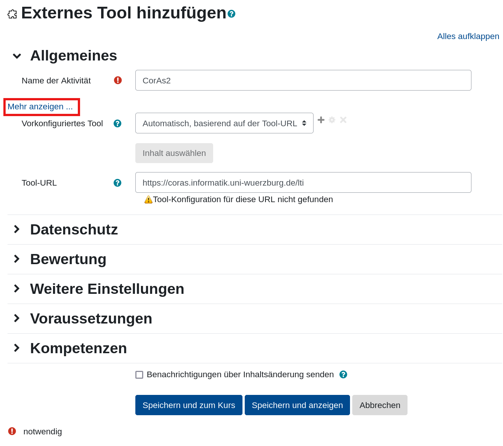
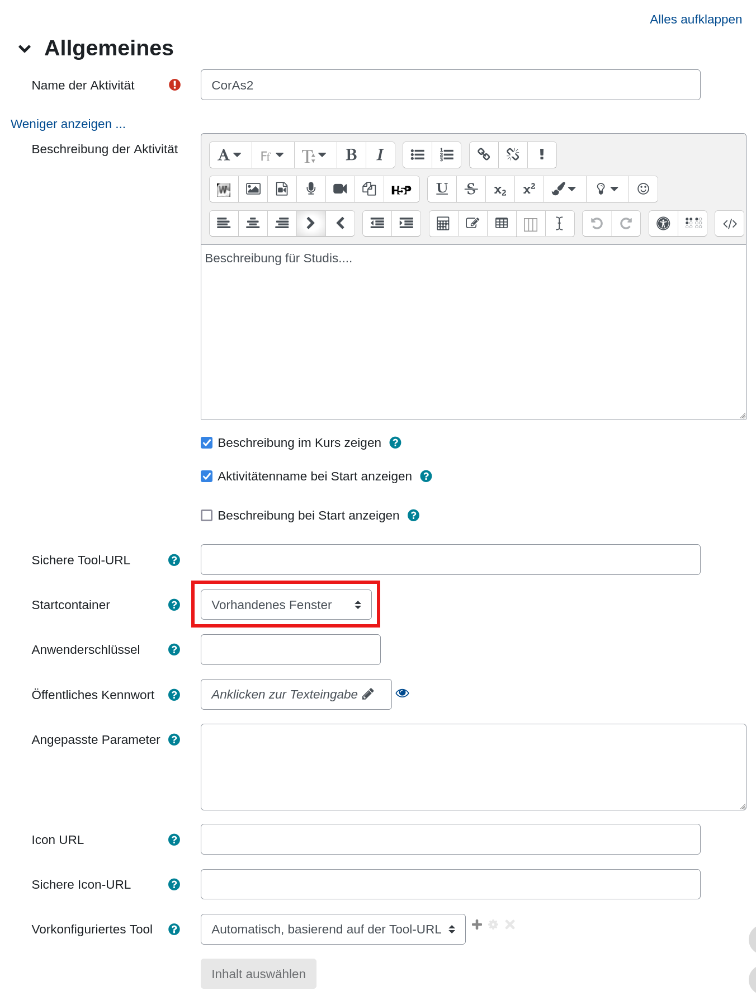

# Installation LTI in Moodle (WueCampus)

Voraussetzungen:

* Bearbeitungsrechte im Kurs

## Vorgehen

* Im Kurs muss eine neue Aktivität angelegt werden mit dem Typ `Externes Tool`
* Der Name der Aktivität ist frei wählbar, möglich wäre z. B. `CorAs2`
* Im Feld `Tool-URL` muss die URL [https://coras.informatik.uni-wuerzburg.de/lti](https://coras.informatik.uni-wuerzburg.de/lti) eingetragen werden

* Außerdem sollte durch einen Klick auf `Mehr anzeigen...` das Untermenü geöffnet werden
* Hier kann eine Beschreibung der Aktivität angegeben werden, die genauer erklärt, was getan werden kann und sollte
* Eventuell sollte auch die Auswahl `Beschreibung im Kurs zeigen` getroffen werden, damit die Beschreibung sofort sichtbar ist
* Im Feld `Startcontainer` muss nun noch die Option `Vorhandenes Fenster` ausgewählt werden.

